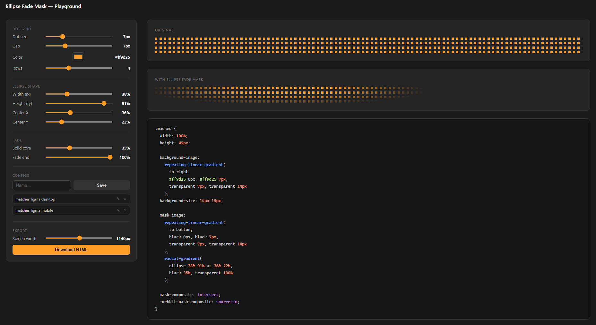

# Ellipse Fade Mask Playground



A browser-based tool for designing CSS dot-grid patterns masked by a radial ellipse fade.

## Technique

Combines three CSS gradients to produce a dot grid that fades out along an ellipse:

```css
.masked {
  background-image:
    repeating-linear-gradient(to right, #ff9d25 0px, #ff9d25 7px, transparent 7px, transparent 14px);
  background-size: 14px 14px;

  mask-image:
    repeating-linear-gradient(to bottom, black 0px, black 7px, transparent 7px, transparent 14px),
    radial-gradient(ellipse 50% 80% at 50% 50%, black 40%, transparent 100%);

  mask-composite: intersect;
  -webkit-mask-composite: source-in;
}
```

- The horizontal gradient paints dot columns.
- The vertical mask cuts dot rows, forming a grid.
- The ellipse radial gradient fades the grid out from the centre.
- `mask-composite: intersect` combines both masks so only dots inside the ellipse are visible.

## Usage

Open `ellipse-mask-playground.html` directly in a browser — no build step or server required.

### Controls

| Section | Controls |
|---|---|
| Dot grid | Dot size, gap, colour, number of rows |
| Ellipse shape | Width (rx), height (ry), center X/Y |
| Fade | Solid core radius, fade-out end |
| Configs | Save, load, rename and delete named configurations (persisted in `localStorage`) |
| Export | Screen width slider + Download HTML |

### Configs

Type a name and click **Save** (or press Enter) to store the current settings. Saved configs appear as a list — click a name to load it, click **✎** to rename inline, click **×** to delete.

### Exporting

Set the target screen width with the slider, then click **Download HTML**. A native Save As dialog opens with the filename pre-filled from the loaded config name. Save the file into the `output/` folder.

## Output

Exported files go in `output/`. Each file is a standalone HTML snippet containing only the `.masked` div and its CSS.
